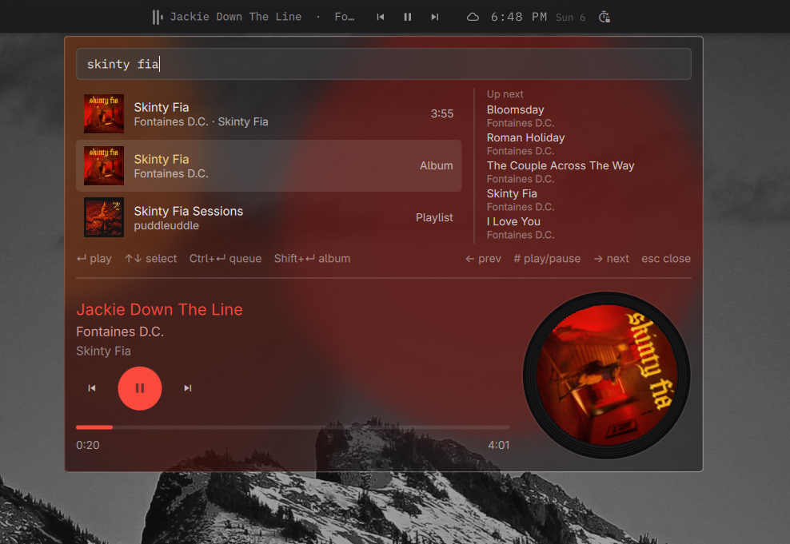
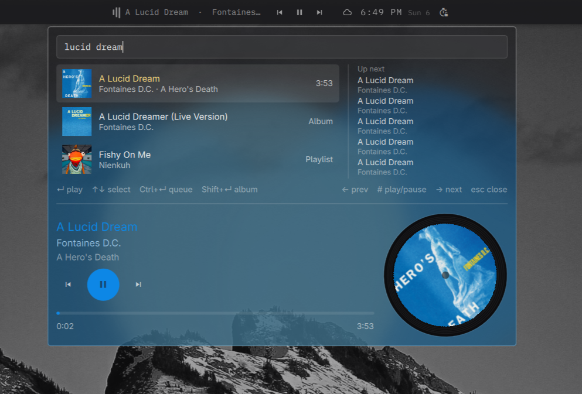

# QuickSpot

A Walker-style Spotify launcher for the [Omarchy](https://omarchy.org) 4 shell.
Press a key, the search field drops in from the top edge, type, press Enter, the
song plays. Search covers tracks, albums and playlists. Below the results sits
what is playing now — artwork as a spinning record, transport controls, a
seekable progress bar, and the next five tracks in the queue.

Every colour comes from your active Omarchy theme, and the background drifts in
the colours of the album currently playing.



Search returns tracks, albums and playlists together. The queue sits on the
right, the player below, and the bar widget along the top shows what is playing
with its own transport controls.



Every colour on the card follows the artwork — the drifting background, the
title, the selection, the play button and the progress bar all move with it.

## Requirements

- Omarchy 4 and Quickshell 0.3.1 or newer
- A Spotify **Premium** account. Search works without it; every playback
  endpoint Spotify offers is Premium-only.
- `socat`, `openssl` and `jq`, all part of a standard Omarchy install
- Somewhere for the music to come out: the Spotify desktop client, the
  `omarchy-spotify` librespot daemon, or any device already on your Spotify
  account, such as a phone.

## Install

```bash
omarchy plugin add https://github.com/RhysCole/quickspot.git --enable
```

## Set up Spotify — about 3 minutes

QuickSpot talks to Spotify as *you*, which means it needs an application
registered under your own Spotify account. Spotify allows only 5 people to use
any one application, so a shared one is not possible — this is a limit of their
platform, not a design choice. Registering your own is free, takes a couple of
minutes, and is the last setup you will do.

You need a **Spotify Premium** account. Search works without it, but every
playback endpoint Spotify offers is Premium-only.

### 1. Open the developer dashboard — 30 seconds

Go to **<https://developer.spotify.com/dashboard>** and log in with the Spotify
account you already use. There is no separate developer account to create; the
first time you visit you will be asked to accept the Developer Terms of Service.

### 2. Create an application — 1 minute

Click **Create app** and fill in:

| Field | What to put |
| --- | --- |
| App name | Anything. `QuickSpot` works. |
| App description | Anything. `Omarchy shell plugin` works. |
| Redirect URI | `http://127.0.0.1:8788/callback` — then click **Add** |
| Which API/SDKs are you planning to use? | Tick **Web API** |

The redirect URI must match exactly, including `http://` and the port, with no
trailing slash. It is the single most common thing to get wrong. `127.0.0.1` is
required — Spotify rejects `localhost`.

Accept the terms and click **Save**.

### 3. Copy your client ID — 15 seconds

On the app's page, open **Settings**. Copy the **Client ID**.

You do **not** need the client secret. QuickSpot signs in with PKCE, which is
designed for apps that cannot keep a secret, so there is nothing here worth
leaking.

### 4. Paste it into QuickSpot — 30 seconds

Bind a key (see below), press it, and paste the client ID into the field that
appears. Press Enter.

### 5. Sign in — 30 seconds

Press Enter again. A browser tab opens asking you to authorise your own app.
Approve it, and the tab reports success. QuickSpot stores only a refresh token,
in `~/.local/state/quickspot/oauth.json`, and never sees your password.

### Something went wrong

| What you see | What it means |
| --- | --- |
| `INVALID_CLIENT: Invalid redirect URI` | The URI in the dashboard is not exactly `http://127.0.0.1:8788/callback`. A trailing slash or `localhost` will do this. |
| Browser says the site cannot be reached | The listener had already timed out, or the shell is running older code. Restart with `omarchy-restart-shell` and try again. |
| `Spotify Premium required` | Playback endpoints are Premium-only. Search still works. |
| `No Spotify device available` | Nothing is playing anywhere. Start a track on your phone, the desktop client, or `systemctl --user start omarchy-spotify`, then retry. |
| `Spotify sign-in did not complete` | The browser tab was closed before approving, or the approval took longer than three minutes. Press Enter to start again. |

## Bind a key

QuickSpot does not edit your Hyprland config. Add this to
`~/.config/hypr/bindings.lua`:

```lua
o.bind("SUPER + SHIFT + S", "Search Spotify",
  "omarchy-shell shell toggle io.github.rhyscole.quickspot '{}'")
```

Then `hyprctl reload`.

## Or click it on the bar

QuickSpot also ships an optional bar icon. Add it with a placement:

```bash
omarchy plugin enable io.github.rhyscole.quickspot right
```

`left`, `center` and `right` all work.

With something playing, the widget shows three bars bouncing beside the track
title, followed by previous, play/pause and next. Clicking the bars or the title
opens the overlay; the transport buttons act in place. With nothing playing it
collapses to a single icon, and does the same on a vertical bar, where there is
no room for a control strip.

**It follows whatever media player is active, not Spotify.** A browser playing a
video drives it identically, and it works with no Spotify account configured at
all — nothing the widget shows or does needs one. Search is the only part of
QuickSpot that does.

`titleWidth` in the settings below controls how much room the title gets before
eliding. The plugin works perfectly well without the bar icon; it is a second
door, not the only one.

## The controls

Play, pause, skip and seek go over MPRIS — the same D-Bus interface your
keyboard's media keys use — whenever there is a local player to talk to. That
is a call to a process on this machine rather than a network round trip, so the
buttons respond immediately, they need no Spotify token, and they cannot fail
the way the Web API does when Spotify has quietly deactivated the device that
was playing a moment ago.

It is deliberately not restricted to Spotify. A browser playing YouTube exports
the same interface, so the controls work on it too, and the panel names the app
it is pointed at when that app is not Spotify. Buttons are greyed out when the
current player says it cannot do something — a live stream that cannot seek, a
video with no previous track.

When nothing is playing locally — the usual case being playback on a phone —
the controls fall back to Spotify's Web API, which is the only way to reach a
device that is not on this machine.

## Starting Spotify

Opening the launcher is the moment you want somewhere for music to go, so if no
Spotify client is running QuickSpot starts one then rather than letting the
first Enter fail with "no device available". It does nothing when a client is
already up, which is the usual case.

Under Hyprland the window opens on the first empty workspace and is left there
unfocused, so starting music does not take over whatever you were doing. The
search is the next workspace up from the one you are on, wrapping to the lower
ones if everything above is occupied.

It tries the native `spotify` package, then Arch's `spotify-launcher`, then the
`com.spotify.Client` Flatpak, and finally the headless `omarchy-spotify`
librespot daemon — worth trying last because QuickSpot's premise is not needing
a window open in the first place. The client is started detached, so restarting
the shell does not take your music down with it.

Set `"launchSpotify": false` to turn this off.

## Where it plays

QuickSpot targets whichever Spotify Connect device is currently active — your
phone, a speaker, the desktop client, or a local librespot daemon. If nothing is
active, it wakes a local daemon over MPRIS and plays there.

Queueing and album playback need an active Connect device; MPRIS has no verb for
either, so QuickSpot says so rather than failing quietly.

## Settings

Settings live in `~/.config/omarchy/shell.json`. Where exactly depends on
whether you have put QuickSpot on the bar: a bar-placed plugin keeps its
settings in its `bar.layout` entry, everything else in the top-level `plugins`
array. QuickSpot reads both, so either works:

```json
{
  "id": "io.github.rhyscole.quickspot",
  "clientId": "your client id",
  "redirectPort": 8788,
  "topMargin": 0,
  "titleWidth": 190,
  "launchSpotify": true
}
```

`clientId` is written for you by the first-run screen. `redirectPort` must match
the redirect URI registered in your Spotify dashboard. `topMargin` is the gap
below the bar in pixels; `0` derives it from the shell's bar tokens, which is
right for the stock bar and may need adjusting for a third-party one.
`titleWidth` is how many pixels the bar widget's track title may take before it
elides. `launchSpotify` starts a Spotify client when the overlay opens and none
is running; set it to `false` to leave that to you.

## The player

Below the results is what is playing now: title, artist and album, transport
controls, a seekable progress bar, and the artwork as a spinning record. It
reads `/v1/me/player` every five seconds while the overlay is open — never while
it is closed — and interpolates the position locally in between, so the bar
moves smoothly without polling harder.

The record spins only while playback is running and holds its angle when paused.
Controls act on whichever Connect device Spotify already considers active.

Behind everything, four blurred blobs drift and pulse in the dominant colours of
the current album art — a lava lamp tinted by what is playing. The track title,
the play button and the progress bar take the album's colour too, lifted in
lightness until they are legible against the card so a dark sleeve cannot make
the text unreadable. Artwork is cached
under `~/.cache/quickspot/art/` and quantized locally; nothing about it is sent
anywhere. When nothing is playing, or a sleeve yields no usable colours, the
theme's own accent stands in. A sleeve that is essentially black or greyscale
gets white instead of the theme, because a black cover coming up green is a
thing no one can explain by looking at it. Blob colours are capped in
brightness: the text is sized for contrast against the card, not against a pale
blob that happens to drift under it.

## What it stores

`~/.local/state/quickspot/` holds `oauth.json`, your refresh token. Nothing
else is written and nothing leaves your machine except requests to Spotify.

The refresh token is a long-lived account credential, so it is not left to the
umask: the directory is forced to `0700` and the file written atomically as
`0600`, through a helper that takes the token on stdin rather than as an
argument — argv is readable by any process on the machine through `/proc`. A
token written by an earlier version has its permissions repaired at startup.

The access token is never written to disk at all, and the client secret is never
involved: sign-in uses PKCE, which is designed for clients that cannot keep
one.

## Development

```bash
./run-tests.sh          # headless unit tests, no compositor or network needed
omarchy plugin validate .
```

The four `.js` modules are pure functions covered by `qmltestrunner`. The QML
files hold only presentation and I/O.

## Current state

In daily use and working end to end: OAuth, search, playback, transport, theming
and the queue have all been exercised against a live account on a running shell.

The pure logic — PKCE, token parsing, search transformation, error
classification, palette selection and playback state — is covered by 87 headless
unit tests that need no compositor, network or Spotify account:

```bash
./run-tests.sh
```

What those tests cannot reach, and what to expect trouble from first: the OAuth
loopback handshake, layer-shell focus behaviour, and anything that depends on
which Spotify device happens to be active. Bug reports welcome.

Known rough edges:

- With the Spotify desktop client open but idle, the panel follows it rather
  than a phone that is actually playing.
- `#` cannot be typed into a search query, and the left and right arrows do not
  move the text cursor — both are spent on playback controls.
- Queue entries repeat when Spotify's repeat mode is on. That is Spotify
  reporting the queue honestly, not a bug here.

## Uninstalling

```bash
omarchy plugin remove io.github.rhyscole.quickspot
omarchy-restart-shell
```

That deletes the plugin and its entry in `~/.config/omarchy/shell.json`,
including your client ID. Three things it does not touch, because nothing else
will clean them up for you:

```bash
rm -rf ~/.local/state/quickspot     # your Spotify refresh token
rm -rf ~/.cache/quickspot           # cached album artwork
```

And the keybind, which QuickSpot never wrote and so will not remove — delete
the `o.bind` line from `~/.config/hypr/bindings.lua` yourself, then
`hyprctl reload`.

Your Spotify application is separate again. It costs nothing to leave, but to be
thorough: <https://developer.spotify.com/dashboard>, open the app, **Settings**,
**Delete app** at the bottom. Removing it revokes QuickSpot's access to your
account outright, which is the surest way to be sure.

## Licence

MIT
